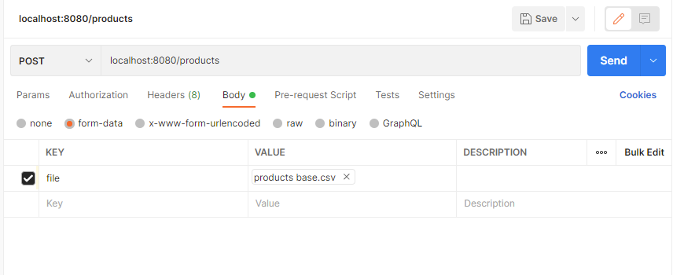

# Transport calculator module

##Loading .csv files:
To upload the files send it via POST.
to get products online use: localhost:8080/products and send it with key "file" like so

and for means of transport use endpoint localhost:8080/means

##Using the calculator:
Get result by using POST request with /calculate mapping for parameter "list", example:

localhost:8080/calculate?list=Product030,Product123,Product421,Product952